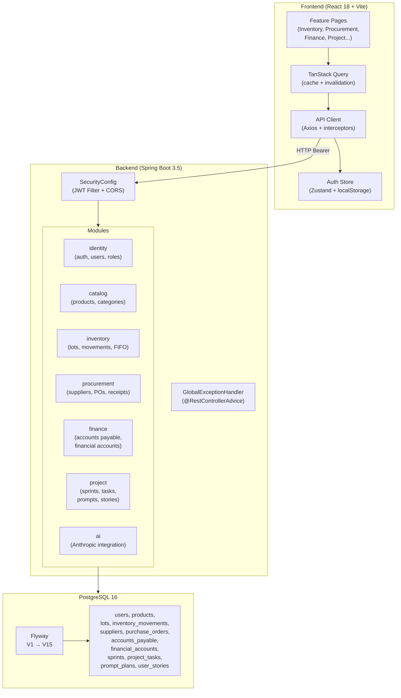
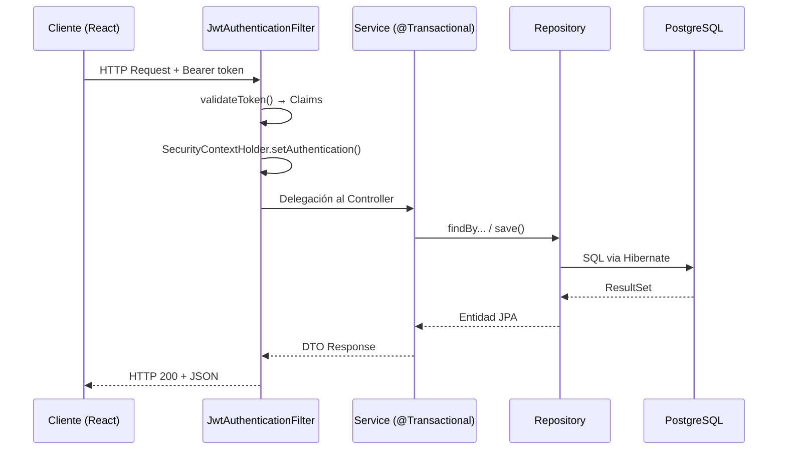
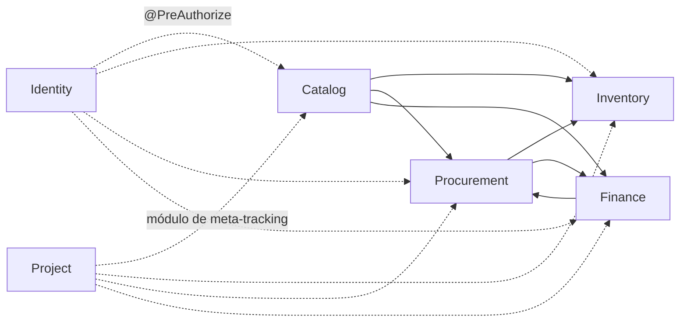

# Arquitectura General — Sapiens ERP

## Stack tecnológico

| Capa | Tecnología | Versión |
|------|-----------|---------|
| Backend | Java + Spring Boot | Java 17 (build), Java 21 (runtime), Spring Boot 3.5.0 |
| Build tool | Gradle Wrapper | `./gradlew` — nunca usar `gradle` global |
| Persistencia | PostgreSQL | 16 |
| Migraciones | Flyway | `classpath:db/migration` |
| ORM | Spring Data JPA + Hibernate | Dialecto PostgreSQL |
| Seguridad | Spring Security + JWT | JJWT 0.12.6 |
| Validación | Jakarta Validation | via Spring Boot starter |
| Utilidades | Lombok | compile-only |
| Frontend | React + TypeScript | React 18, TypeScript |
| Bundler | Vite | — |
| Estado | Zustand | persist middleware |
| HTTP | Axios | con interceptores JWT |
| Queries | TanStack Query | useQuery / useMutation |

> **Nota del Arquitecto**: El `build.gradle.kts` declara `sourceCompatibility = JavaVersion.VERSION_17` y `targetCompatibility = JavaVersion.VERSION_17`, pero el CLAUDE.md indica Java 21. El bytecode compilado es Java 17. Verificar si el runtime es Java 21 o si hay inconsistencia.

## Puertos y URLs

| Servicio | Puerto | URL base |
|---------|--------|---------|
| Backend API | 8080 | `http://localhost:8080/api/v1/` |
| Frontend Dev | 5173 | `http://localhost:5173` |
| PostgreSQL | 5432 | `sapiens_erp` / usuario `sapiens` |
| Health check | 8080 | `/actuator/health` |

## Diagrama de arquitectura



## Capas del backend (por módulo)

```
modules/<modulo>/
├── api/
│   ├── <ModuleName>Controller.java     ← REST endpoints, sin lógica
│   └── dto/
│       ├── <Entity>Request.java        ← Input (validado con @Valid)
│       └── <Entity>Response.java       ← Output (record con factory from())
├── application/
│   └── <ModuleName>Service.java        ← Toda la lógica. @Transactional aquí.
└── domain/
    ├── <Entity>.java                   ← Entidad JPA, extiende AuditableEntity
    ├── <Entity>Repository.java         ← Spring Data JPA
    ├── <SomeEnum>.java
    └── exception/
        └── <Something>Exception.java
```

## Flujo de una petición autenticada



## Manejo de errores

El `GlobalExceptionHandler` centraliza todas las excepciones:

| Excepción | HTTP | Código de error |
|-----------|------|-----------------|
| `MethodArgumentNotValidException` | 400 | `VALIDATION_ERROR` |
| `EntityNotFoundException` | 404 | `NOT_FOUND` |
| `InsufficientStockException` | 422 | `INSUFFICIENT_STOCK` |
| `BadCredentialsException` | 401 | `UNAUTHORIZED` |
| `AccessDeniedException` | 403 | `FORBIDDEN` |
| `IllegalArgumentException` | 409 | `CONFLICT` |
| `Exception` (genérica) | 500 | `INTERNAL_ERROR` |

Formato de respuesta de error:
```json
{
  "status": 422,
  "error": "INSUFFICIENT_STOCK",
  "message": "Stock insuficiente para el producto ...",
  "timestamp": "2026-06-28T10:00:00Z"
}
```

## Módulos y dependencias entre bounded contexts


