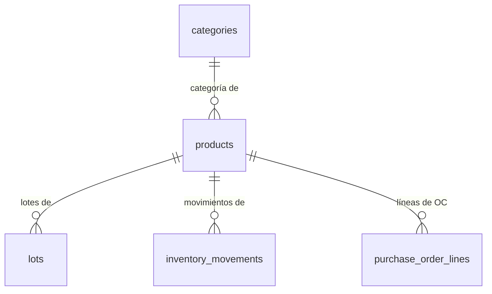

# Catalog — Base de Datos

## Migraciones aplicables

| Migración | Cambios |
|-----------|---------|
| V2 | Crea `categories` y `products` |
| V3 | Convierte timestamps a TIMESTAMPTZ; reemplaza unique constraint de email (solo en users) |
| V7 | Agrega columnas extendidas a `products`: sku, barcode, product_type, purchaseCost, averageCost, etc. |
| V9 | Agrega `purchase_cost_last` y `average_cost` a `products` |
| V10 | Crea `product_sku_seq`; agrega índice único parcial sobre `sku` |

---

## Tabla: `categories`

```sql
CREATE TABLE categories (
    id          UUID PRIMARY KEY,
    name        VARCHAR(100)            NOT NULL,
    description TEXT,
    created_at  TIMESTAMPTZ             NOT NULL DEFAULT NOW(),
    updated_at  TIMESTAMPTZ             NOT NULL DEFAULT NOW(),
    deleted_at  TIMESTAMPTZ
);

CREATE UNIQUE INDEX uq_categories_name_active
    ON categories (LOWER(name))
    WHERE deleted_at IS NULL;
```

---

## Tabla: `products`

```sql
CREATE TABLE products (
    id                          UUID PRIMARY KEY,
    name                        VARCHAR(100)    NOT NULL,
    category_id                 UUID REFERENCES categories(id) ON DELETE RESTRICT,
    unit_of_measure             VARCHAR(10)     NOT NULL
        CHECK (unit_of_measure IN ('KG', 'LB', 'UNIT', 'PACKAGE', 'LITER')),
    minimum_stock               NUMERIC(10,3)   NOT NULL DEFAULT 0,
    description                 TEXT,
    active                      BOOLEAN         NOT NULL DEFAULT TRUE,
    -- Agregados en V7 --
    sku                         VARCHAR(50),
    barcode                     VARCHAR(100),
    product_type                VARCHAR(30),
    purchase_cost               NUMERIC(14,4),
    sale_price                  NUMERIC(14,4),
    inventory_tracking_enabled  BOOLEAN         NOT NULL DEFAULT TRUE,
    default_warehouse           VARCHAR(100),
    status                      VARCHAR(20)     NOT NULL DEFAULT 'ACTIVE'
        CHECK (status IN ('DRAFT', 'ACTIVE', 'INACTIVE')),
    image_url                   TEXT,
    -- Agregados en V9 --
    purchase_cost_last          NUMERIC(14,4),
    average_cost                NUMERIC(14,4),
    -- Auditoría --
    created_at                  TIMESTAMPTZ     NOT NULL DEFAULT NOW(),
    updated_at                  TIMESTAMPTZ     NOT NULL DEFAULT NOW(),
    deleted_at                  TIMESTAMPTZ
);
```

---

## Índices

```sql
-- Unicidad de nombre entre productos activos (V2 + V3)
CREATE UNIQUE INDEX uq_products_name_active
    ON products (LOWER(name))
    WHERE deleted_at IS NULL;

-- Unicidad de SKU entre productos activos (V10)
CREATE UNIQUE INDEX uq_products_sku_active
    ON products (sku)
    WHERE deleted_at IS NULL AND sku IS NOT NULL;
```

---

## Secuencia

```sql
-- Creada en V10
CREATE SEQUENCE product_sku_seq START 1 INCREMENT 1;
```

Usada por `ProductService` para generar SKUs del formato `PRO-000001`.

---

## Relaciones



---

## Notas

- Los índices únicos son parciales (`WHERE deleted_at IS NULL`) para permitir reutilización de nombres/SKUs en productos eliminados.
- `category_id` puede ser NULL (categoría opcional).
- `product_type` no tiene CHECK constraint en BD — la validación ocurre solo a nivel de enum Java.
- `average_cost` y `purchase_cost_last` se actualizan mediante `UPDATE` en cada entrada de inventario; no se derivan de movimientos.
