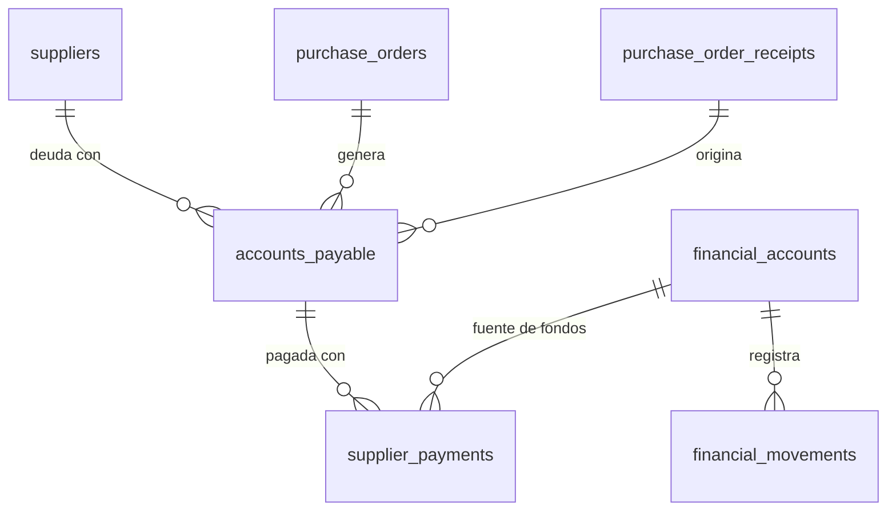

# Finance — Base de Datos

## Migraciones aplicables

| Migración | Cambios |
|-----------|---------|
| V8 | Crea `accounts_payable` |
| V11 | Agrega `receipt_id`, `supplier_id` a `accounts_payable`; crea `supplier_payments`; secuencia `invoice_number_seq` |
| V12 | Agrega `payment_origin`, `supplier_account`, `reference_number` a `supplier_payments` |
| V13 | Crea `financial_accounts`, `financial_movements`; agrega FK `financial_account_id` a `supplier_payments`; seed 2 cuentas |

---

## Tabla: `accounts_payable`

```sql
CREATE TABLE accounts_payable (
    id                  UUID            PRIMARY KEY,
    purchase_order_id   UUID            NOT NULL REFERENCES purchase_orders(id),
    receipt_id          UUID            REFERENCES purchase_order_receipts(id),  -- V11
    supplier_id         UUID            REFERENCES suppliers(id),                -- V11
    invoice_number      VARCHAR(20)     NOT NULL UNIQUE,
    total_amount        NUMERIC(14,4)   NOT NULL,
    paid_amount         NUMERIC(14,4)   NOT NULL DEFAULT 0,
    status              VARCHAR(20)     NOT NULL DEFAULT 'PENDING'
        CHECK (status IN ('PENDING','PARTIALLY_PAID','PAID','CANCELLED')),
    due_date            DATE            NOT NULL,
    notes               TEXT,
    created_at          TIMESTAMPTZ     NOT NULL DEFAULT NOW(),
    updated_at          TIMESTAMPTZ     NOT NULL DEFAULT NOW(),
    deleted_at          TIMESTAMPTZ
);
```

---

## Tabla: `supplier_payments`

```sql
CREATE TABLE supplier_payments (
    id                      UUID            PRIMARY KEY,
    accounts_payable_id     UUID            NOT NULL REFERENCES accounts_payable(id),
    amount                  NUMERIC(14,4)   NOT NULL,
    payment_date            DATE            NOT NULL,
    payment_method          VARCHAR(50),
    payment_origin          VARCHAR(100),   -- V12
    supplier_account        VARCHAR(100),   -- V12
    reference_number        VARCHAR(100),   -- V12
    financial_account_id    UUID REFERENCES financial_accounts(id),  -- V13
    notes                   TEXT,
    created_at              TIMESTAMPTZ     NOT NULL DEFAULT NOW(),
    updated_at              TIMESTAMPTZ     NOT NULL DEFAULT NOW()
);
```

---

## Tabla: `financial_accounts`

```sql
CREATE TABLE financial_accounts (
    id            UUID            PRIMARY KEY,
    name          VARCHAR(100)    NOT NULL,
    account_type  VARCHAR(20)     NOT NULL
        CHECK (account_type IN ('CASH', 'BANK', 'CREDIT')),
    balance       NUMERIC(14,4)   NOT NULL DEFAULT 0,
    currency      VARCHAR(3)      NOT NULL DEFAULT 'CLP',
    description   TEXT,
    active        BOOLEAN         NOT NULL DEFAULT TRUE,
    created_at    TIMESTAMPTZ     NOT NULL DEFAULT NOW(),
    updated_at    TIMESTAMPTZ     NOT NULL DEFAULT NOW(),
    deleted_at    TIMESTAMPTZ
);
```

**Datos seed de V13:**
```sql
INSERT INTO financial_accounts (id, name, account_type, balance, currency, active, created_at, updated_at)
VALUES
  (gen_random_uuid(), 'Caja Principal', 'CASH', 0, 'CLP', true, NOW(), NOW()),
  (gen_random_uuid(), 'Cuenta Bancaria', 'BANK', 0, 'CLP', true, NOW(), NOW());
```

---

## Tabla: `financial_movements`

```sql
CREATE TABLE financial_movements (
    id                      UUID            PRIMARY KEY,
    financial_account_id    UUID            NOT NULL REFERENCES financial_accounts(id),
    movement_type           VARCHAR(20)     NOT NULL
        CHECK (movement_type IN ('INCOME', 'EXPENSE')),
    amount                  NUMERIC(14,4)   NOT NULL,
    balance_before          NUMERIC(14,4)   NOT NULL,
    balance_after           NUMERIC(14,4)   NOT NULL,
    description             TEXT,
    reference_id            UUID,
    created_at              TIMESTAMPTZ     NOT NULL DEFAULT NOW()
);

CREATE INDEX idx_financial_movements_account ON financial_movements(financial_account_id);
CREATE INDEX idx_financial_movements_created ON financial_movements(created_at);
```

---

## Relaciones


