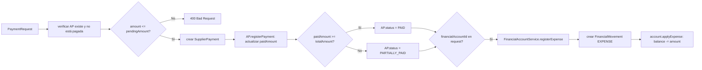

# Finance — Visión General

## Objetivo

Gestiona las obligaciones financieras de la pescadería: cuentas por pagar a proveedores, pagos realizados, y movimientos de cuentas financieras (caja/banco). Es el módulo que cierra el ciclo económico iniciado en Procurement.

## Responsabilidades

- Gestión de cuentas por pagar (`AccountsPayable`) generadas por recepciones de OC
- Registro de pagos a proveedores (`SupplierPayment`)
- CRUD de cuentas financieras (caja, banco) — `FinancialAccount`
- Registro de movimientos financieros (ingresos y egresos) — `FinancialMovement`
- Actualización del saldo de cuenta en tiempo real

## Dependencias

- **Procurement**: `AccountsPayableService.createFromReceipt()` es llamado por `PurchaseOrderService`
- **Catalog / Identity**: sin dependencias directas

## Casos de uso principales

1. Procurement crea automáticamente una AP al recibir una OC
2. Tesorero paga una AP parcial o total desde la caja
3. El pago descuenta el saldo de la cuenta financiera
4. Supervisor consulta el saldo de la caja principal

## Flujo de pago de una cuenta por pagar

