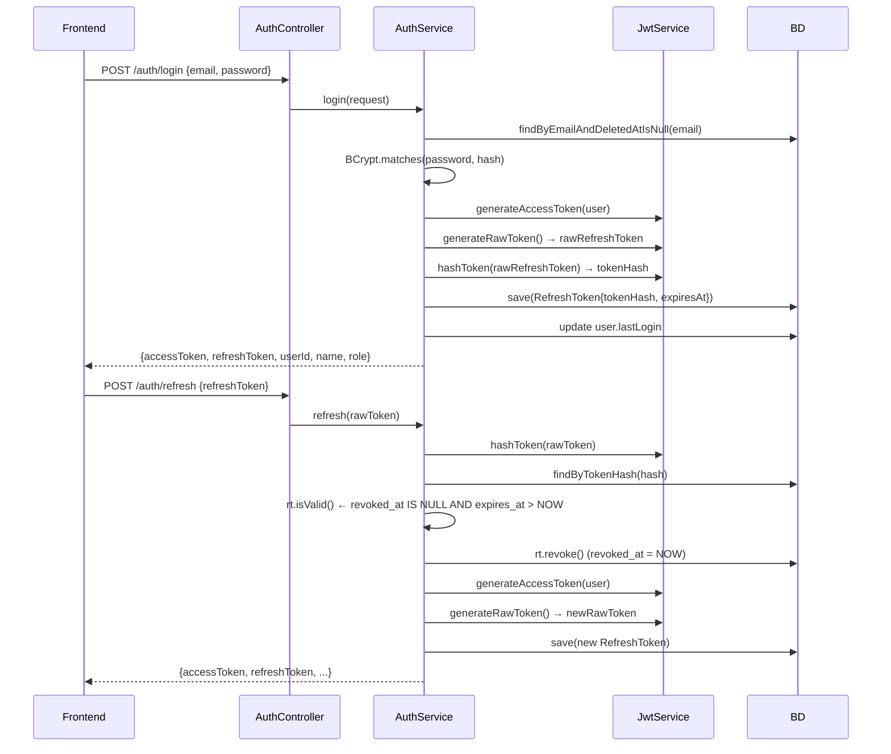

# Identity — Visión General

## Objetivo

Gestiona la autenticación y autorización de los usuarios del sistema. Implementa JWT stateless con rotación de refresh tokens.

## Responsabilidades

- Autenticación de usuarios (login con email/password)
- Emisión y validación de access tokens JWT (15 min)
- Gestión de refresh tokens (7 días, rotación en cada uso)
- Logout (revocación de refresh token)
- Seed del usuario administrador inicial
- Filtrado de peticiones (JwtAuthenticationFilter en cada request)

## Dependencias con otros módulos

- Ninguna dependencia de entrada de otros módulos de negocio
- Todos los módulos dependen de `Identity` via Spring Security (`@PreAuthorize`, `SecurityContextHolder`)

## Casos de uso principales

1. El operador inicia sesión → recibe access token y refresh token
2. El frontend renueva el access token automáticamente cuando expira (interceptor Axios)
3. El usuario cierra sesión → el refresh token queda revocado en BD
4. El filtro JWT valida cada petición autenticada y establece el contexto de seguridad

## Flujo de autenticación

