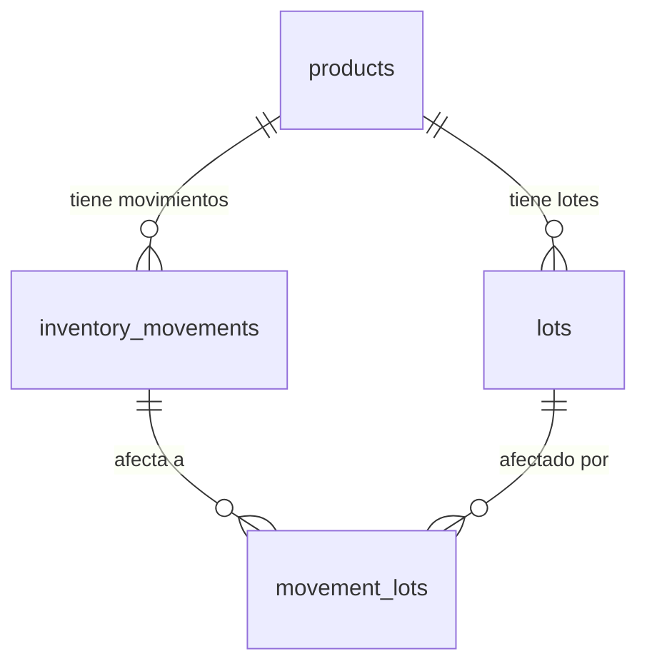

# Inventory — Base de Datos

## Migraciones aplicables

| Migración | Cambios |
|-----------|---------|
| V4 | Crea `lots`, `inventory_movements`, `movement_lots`; RULE de inmutabilidad |
| V9 | Agrega `previous_average_cost`, `new_average_cost` a `inventory_movements` |

---

## Tabla: `lots`

```sql
CREATE TABLE lots (
    id                   UUID            PRIMARY KEY,
    product_id           UUID            NOT NULL REFERENCES products(id) ON DELETE RESTRICT,
    initial_quantity     NUMERIC(10,3)   NOT NULL CHECK (initial_quantity > 0),
    current_quantity     NUMERIC(10,3)   NOT NULL,
    unit_cost            NUMERIC(14,4),
    received_at          TIMESTAMPTZ     NOT NULL DEFAULT NOW(),
    expiration_date      DATE,
    supplier_batch_code  VARCHAR(100)
);

CREATE INDEX idx_lots_product_id ON lots(product_id);
CREATE INDEX idx_lots_received_at ON lots(received_at);
```

**Nota**: Sin `created_at`/`updated_at`/`deleted_at`. Diseño intencional: los lotes son registros de ingreso físico, no entidades de negocio con ciclo de vida.

---

## Tabla: `inventory_movements`

```sql
CREATE TABLE inventory_movements (
    id                      UUID            PRIMARY KEY,
    product_id              UUID            NOT NULL REFERENCES products(id) ON DELETE RESTRICT,
    movement_type           VARCHAR(30)     NOT NULL
        CHECK (movement_type IN ('ENTRY','EXIT','WASTE','POSITIVE_ADJUSTMENT','NEGATIVE_ADJUSTMENT')),
    quantity                NUMERIC(10,3)   NOT NULL CHECK (quantity > 0),
    unit_cost               NUMERIC(14,4),
    total_cost              NUMERIC(14,4),
    reason                  TEXT,
    -- Agregados en V9 --
    previous_average_cost   NUMERIC(14,4),
    new_average_cost        NUMERIC(14,4),
    created_at              TIMESTAMPTZ     NOT NULL DEFAULT NOW()
);

CREATE INDEX idx_inventory_movements_product_id ON inventory_movements(product_id);
CREATE INDEX idx_inventory_movements_created_at ON inventory_movements(created_at);
```

### RULE de inmutabilidad (PostgreSQL)

```sql
CREATE RULE no_update_inventory_movements
    AS ON UPDATE TO inventory_movements
    DO INSTEAD NOTHING;

CREATE RULE no_delete_inventory_movements
    AS ON DELETE TO inventory_movements
    DO INSTEAD NOTHING;
```

Este mecanismo garantiza que ningún proceso (incluyendo migraciones accidentales) pueda modificar o eliminar movimientos registrados.

---

## Tabla: `movement_lots`

```sql
CREATE TABLE movement_lots (
    id           UUID            PRIMARY KEY,
    movement_id  UUID            NOT NULL REFERENCES inventory_movements(id),
    lot_id       UUID            NOT NULL REFERENCES lots(id),
    quantity     NUMERIC(10,3)   NOT NULL
);

CREATE INDEX idx_movement_lots_movement_id ON movement_lots(movement_id);
CREATE INDEX idx_movement_lots_lot_id ON movement_lots(lot_id);
```

---

## Relaciones



---

## Query: stock actual

```sql
SELECT COALESCE(SUM(
    CASE
        WHEN im.movement_type IN ('ENTRY', 'POSITIVE_ADJUSTMENT') THEN im.quantity
        ELSE -im.quantity
    END
), 0)
FROM inventory_movements im
WHERE im.product_id = :productId;
```

Esta query se ejecuta en toda consulta de stock. Para escalar, se podría considerar una vista materializada o snapshot periódico, pero actualmente no está implementado.
