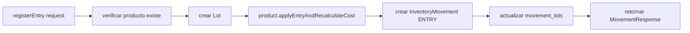
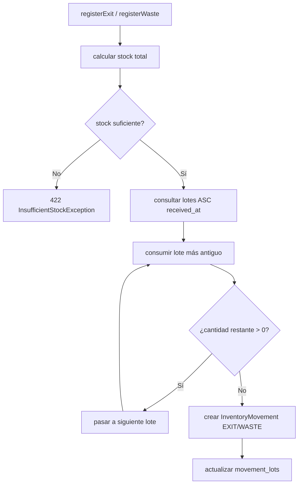

# Inventory — Visión General

## Objetivo

Gestiona el stock físico de productos. Es el **Core Domain** del sistema: registra cada entrada, salida, merma y ajuste de inventario mediante movimientos inmutables, y calcula el stock real sumando dichos movimientos.

## Principios fundamentales

1. **Stock nunca se almacena directamente.** El stock actual de un producto se calcula consultando los movimientos de inventario. No existe `setStockActual()`.
2. **Movimientos inmutables.** La tabla `inventory_movements` es append-only. PostgreSQL tiene una RULE que bloquea UPDATE y DELETE a nivel de base de datos.
3. **FIFO para consumo de lotes.** Los lotes se consumen en orden de `received_at` ascendente (el más antiguo primero).
4. **Stock no puede ser negativo.** Toda salida verifica stock suficiente antes de proceder. Si el stock es insuficiente, lanza `InsufficientStockException` → HTTP 422.
5. **Merma requiere motivo.** El campo `reason` es obligatorio en movimientos de tipo WASTE.

## Responsabilidades

- Registro de entradas de stock (generado por Procurement al recibir una OC)
- Registro de salidas manuales
- Registro de mermas con motivo
- Ajustes positivos y negativos de inventario
- Consulta de stock actual por producto
- Listado de lotes activos y movimientos

## Dependencias

- **Catalog**: necesita `Product` para registrar movimientos
- **Procurement**: llama a `InventoryService.registerEntry()` al recibir OC

## Casos de uso principales

1. Sistema registra entrada de 50 KG de merluza al recibir una OC
2. Operador registra salida de 5 KG por venta manual
3. Operador registra merma de 2 KG por deterioro, con motivo "Producto vencido"
4. Supervisor realiza ajuste positivo de 3 KG por recuento físico

## Flujo de entrada de stock

## Flujo de consumo FIFO

