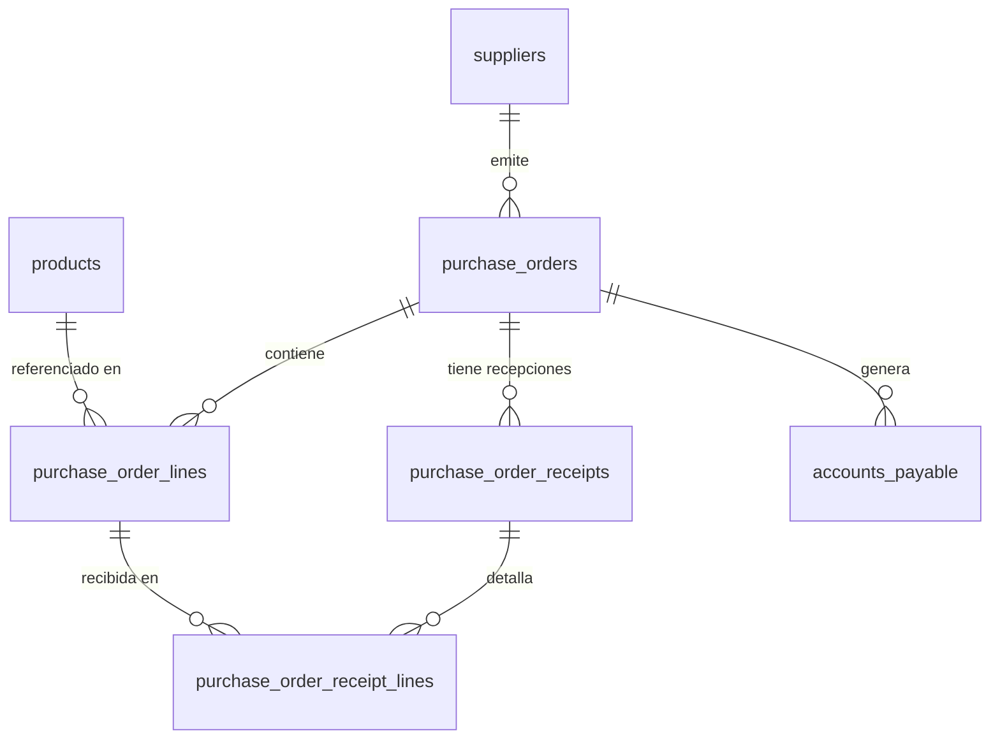

# Procurement — Base de Datos

## Migraciones aplicables

| Migración | Cambios |
|-----------|---------|
| V5 | Crea `suppliers` |
| V6 | Crea `purchase_orders`, `purchase_order_lines`, secuencia `po_number_seq` |
| V7 | Agrega `discount` por línea a `purchase_order_lines` |
| V11 | Crea `purchase_order_receipts`, `purchase_order_receipt_lines`; secuencia `invoice_number_seq` |

---

## Tabla: `suppliers`

```sql
CREATE TABLE suppliers (
    id            UUID          PRIMARY KEY,
    name          VARCHAR(200)  NOT NULL,
    tax_id        VARCHAR(20),
    contact_name  VARCHAR(100),
    phone         VARCHAR(20),
    email         VARCHAR(100),
    address       TEXT,
    notes         TEXT,
    created_at    TIMESTAMPTZ   NOT NULL DEFAULT NOW(),
    updated_at    TIMESTAMPTZ   NOT NULL DEFAULT NOW(),
    deleted_at    TIMESTAMPTZ
);
```

---

## Tabla: `purchase_orders`

```sql
CREATE TABLE purchase_orders (
    id                UUID          PRIMARY KEY,
    order_number      VARCHAR(20)   NOT NULL UNIQUE,
    supplier_id       UUID          NOT NULL REFERENCES suppliers(id),
    status            VARCHAR(30)   NOT NULL DEFAULT 'DRAFT'
        CHECK (status IN ('DRAFT','CONFIRMED','PARTIALLY_RECEIVED','RECEIVED','CANCELLED')),
    notes             TEXT,
    expected_delivery DATE,
    confirmed_at      TIMESTAMPTZ,
    received_at       TIMESTAMPTZ,
    created_at        TIMESTAMPTZ   NOT NULL,
    updated_at        TIMESTAMPTZ   NOT NULL,
    deleted_at        TIMESTAMPTZ
);
```

**Nota**: `created_at` y `updated_at` no tienen `DEFAULT NOW()` en la migración V6. Dependen exclusivamente del mecanismo de auditoría JPA (`@CreatedDate`, `@LastModifiedDate`).

---

## Tabla: `purchase_order_lines`

```sql
CREATE TABLE purchase_order_lines (
    id                    UUID            PRIMARY KEY,
    purchase_order_id     UUID            NOT NULL REFERENCES purchase_orders(id),
    product_id            UUID            NOT NULL REFERENCES products(id),
    quantity              NUMERIC(10,3)   NOT NULL CHECK (quantity > 0),
    unit_price            NUMERIC(14,4)   NOT NULL,
    discount              NUMERIC(5,2)    NOT NULL DEFAULT 0,   -- agregado en V7
    tax_rate              NUMERIC(5,2)    NOT NULL DEFAULT 0,
    received_quantity     NUMERIC(10,3)   NOT NULL DEFAULT 0,
    created_at            TIMESTAMPTZ     NOT NULL,
    updated_at            TIMESTAMPTZ     NOT NULL
);
```

---

## Tabla: `purchase_order_receipts`

```sql
CREATE TABLE purchase_order_receipts (
    id                  UUID          PRIMARY KEY,
    purchase_order_id   UUID          NOT NULL REFERENCES purchase_orders(id),
    receipt_number      VARCHAR(20)   NOT NULL UNIQUE,
    received_at         TIMESTAMPTZ   NOT NULL DEFAULT NOW(),
    notes               TEXT
);
```

---

## Tabla: `purchase_order_receipt_lines`

```sql
CREATE TABLE purchase_order_receipt_lines (
    id                      UUID            PRIMARY KEY,
    receipt_id              UUID            NOT NULL REFERENCES purchase_order_receipts(id),
    purchase_order_line_id  UUID            NOT NULL REFERENCES purchase_order_lines(id),
    received_quantity       NUMERIC(10,3)   NOT NULL
);
```

---

## Secuencias

```sql
CREATE SEQUENCE po_number_seq START 1001 INCREMENT 1;   -- V6
CREATE SEQUENCE invoice_number_seq START 1 INCREMENT 1; -- V11
```

---

## Relaciones


