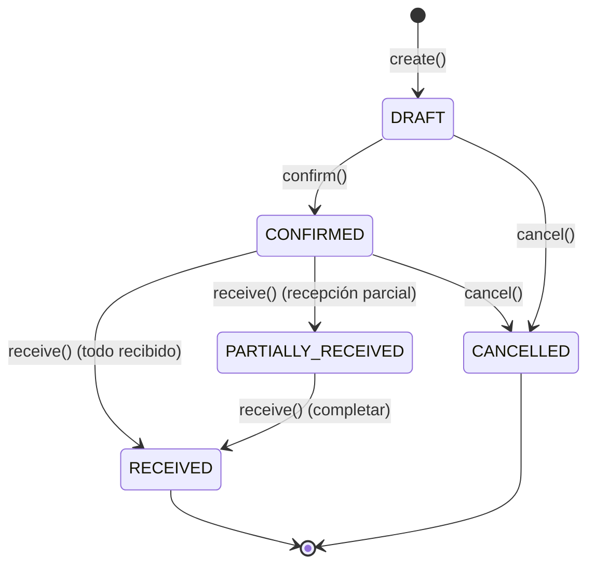
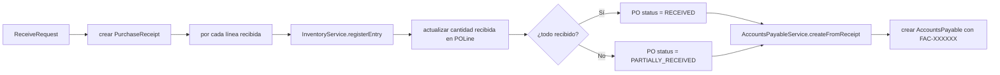

# Procurement — Visión General

## Objetivo

Gestiona el ciclo completo de compras: desde la creación de órdenes de compra hasta su recepción física, incluyendo la integración con Inventory para actualizar stock y con Finance para generar cuentas por pagar.

## Responsabilidades

- CRUD de proveedores
- Creación y gestión de órdenes de compra (OC) con líneas de productos
- Ciclo de vida de OC: DRAFT → CONFIRMED → RECEIVED / PARTIALLY_RECEIVED / CANCELLED
- Recepción parcial o total de mercancía
- Generación automática de número de OC (`OC-1001`, `OC-1002`…)
- Coordinación con `InventoryService` para registrar entradas de stock
- Coordinación con `AccountsPayableService` para generar facturas a pagar

## Dependencias

- **Catalog**: necesita `Product` para líneas de OC
- **Inventory**: llama a `registerEntry()` al recibir mercancía
- **Finance**: llama a `createFromReceipt()` para generar cuentas por pagar

## Casos de uso principales

1. Operador crea una OC con 3 líneas de productos para un proveedor
2. Supervisor confirma la OC (pasa de DRAFT a CONFIRMED)
3. Al llegar la mercancía, operador registra la recepción (total o parcial)
4. El sistema crea automáticamente las entradas de inventario y la cuenta por pagar

## Flujo de ciclo de vida de una OC

## Flujo de recepción

