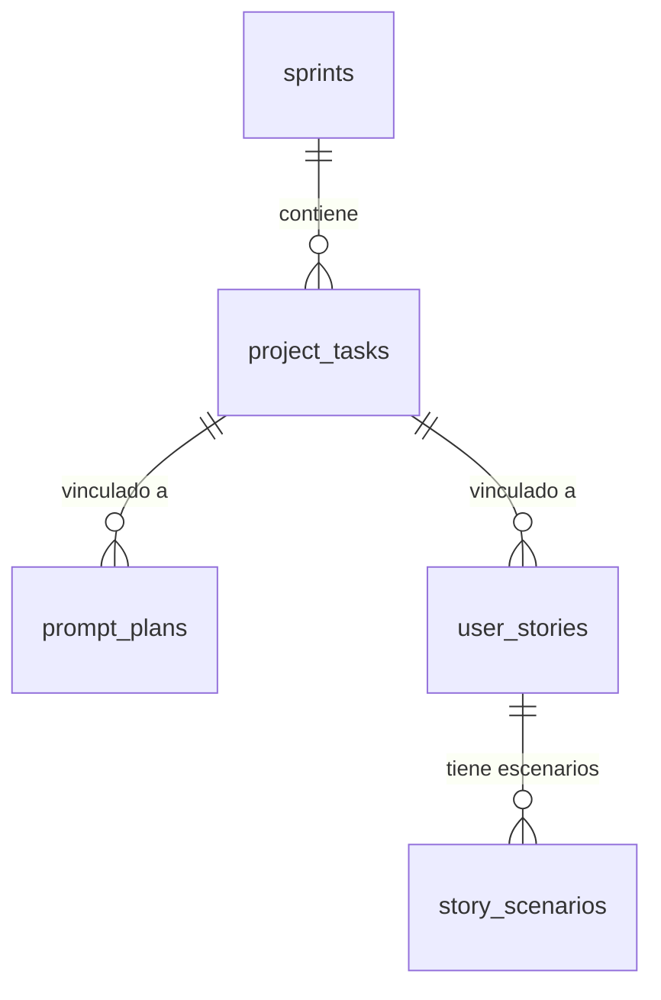

# Project — Base de Datos

## Migraciones aplicables

| Migración | Cambios |
|-----------|---------|
| V14 | Crea `sprints`, `project_tasks`, `prompt_plans`; seed Sprint 1 |
| V15 | Crea `user_stories`, `story_scenarios` |

---

## Tabla: `sprints`

```sql
CREATE TABLE sprints (
    id          UUID          PRIMARY KEY,
    name        VARCHAR(100)  NOT NULL,
    goal        TEXT,
    start_date  DATE,
    end_date    DATE,
    status      VARCHAR(20)   NOT NULL DEFAULT 'DRAFT'
        CHECK (status IN ('DRAFT', 'ACTIVE', 'COMPLETED')),
    created_at  TIMESTAMPTZ   NOT NULL DEFAULT NOW(),
    updated_at  TIMESTAMPTZ   NOT NULL DEFAULT NOW(),
    deleted_at  TIMESTAMPTZ
);
```

**Seed de V14:**
```sql
INSERT INTO sprints (id, name, goal, start_date, end_date, status, created_at, updated_at)
VALUES (
    gen_random_uuid(),
    'Sprint 1 — Fundaciones',
    'Establecer la arquitectura base y los módulos core del sistema',
    '2025-05-01',
    '2025-05-31',
    'ACTIVE',
    NOW(), NOW()
);
```

---

## Tabla: `project_tasks`

```sql
CREATE TABLE project_tasks (
    id            UUID          PRIMARY KEY,
    sprint_id     UUID          REFERENCES sprints(id),
    title         VARCHAR(200)  NOT NULL,
    description   TEXT,
    status        VARCHAR(20)   NOT NULL DEFAULT 'TODO'
        CHECK (status IN ('TODO','IN_PROGRESS','IN_REVIEW','DONE','BLOCKED')),
    assignee      VARCHAR(20)
        CHECK (assignee IN ('MANUEL','ISKIAN')),
    module        VARCHAR(50),
    priority      VARCHAR(10)   NOT NULL DEFAULT 'MEDIUM'
        CHECK (priority IN ('LOW','MEDIUM','HIGH','CRITICAL')),
    completed_at  TIMESTAMPTZ,
    created_at    TIMESTAMPTZ   NOT NULL DEFAULT NOW(),
    updated_at    TIMESTAMPTZ   NOT NULL DEFAULT NOW(),
    deleted_at    TIMESTAMPTZ
);

CREATE INDEX idx_project_tasks_sprint_id ON project_tasks(sprint_id);
CREATE INDEX idx_project_tasks_status ON project_tasks(status) WHERE deleted_at IS NULL;
```

---

## Tabla: `prompt_plans`

```sql
CREATE TABLE prompt_plans (
    id              UUID          PRIMARY KEY,
    title           VARCHAR(200)  NOT NULL,
    objective       TEXT,
    context_info    TEXT,
    prompt_content  TEXT          NOT NULL,
    module          VARCHAR(50),
    category        VARCHAR(30)
        CHECK (category IN ('FEATURE','BUG_FIX','REFACTOR','TEST','DOCUMENTATION','MIGRATION','CONFIGURATION')),
    status          VARCHAR(20)   NOT NULL DEFAULT 'DRAFT'
        CHECK (status IN ('DRAFT','READY','USED','ARCHIVED')),
    linked_task_id  UUID          REFERENCES project_tasks(id),
    created_at      TIMESTAMPTZ   NOT NULL DEFAULT NOW(),
    updated_at      TIMESTAMPTZ   NOT NULL DEFAULT NOW(),
    deleted_at      TIMESTAMPTZ
);
```

---

## Tabla: `user_stories`

```sql
CREATE TABLE user_stories (
    id                    UUID          PRIMARY KEY,
    task_id               UUID          REFERENCES project_tasks(id),
    title                 VARCHAR(200)  NOT NULL,
    as_a                  VARCHAR(100),
    i_want                TEXT,
    so_that               TEXT,
    acceptance_criteria   TEXT,
    priority              VARCHAR(10)   NOT NULL DEFAULT 'MEDIUM'
        CHECK (priority IN ('LOW','MEDIUM','HIGH','CRITICAL')),
    status                VARCHAR(20)   NOT NULL DEFAULT 'DRAFT'
        CHECK (status IN ('DRAFT','READY','IN_PROGRESS','DONE','ARCHIVED')),
    module                VARCHAR(50),
    created_at            TIMESTAMPTZ   NOT NULL DEFAULT NOW(),
    updated_at            TIMESTAMPTZ   NOT NULL DEFAULT NOW(),
    deleted_at            TIMESTAMPTZ
);
```

---

## Tabla: `story_scenarios`

```sql
CREATE TABLE story_scenarios (
    id              UUID          PRIMARY KEY,
    user_story_id   UUID          NOT NULL REFERENCES user_stories(id),
    title           VARCHAR(200)  NOT NULL,
    given_text      TEXT,
    when_text       TEXT,
    then_text       TEXT,
    created_at      TIMESTAMPTZ   NOT NULL DEFAULT NOW(),
    updated_at      TIMESTAMPTZ   NOT NULL DEFAULT NOW()
);

CREATE INDEX idx_story_scenarios_user_story_id ON story_scenarios(user_story_id);
```

---

## Relaciones


