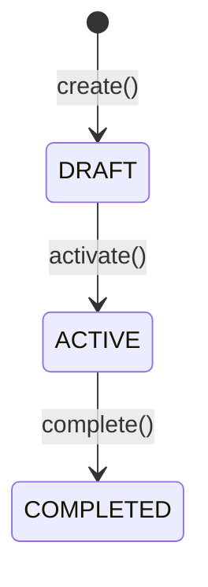
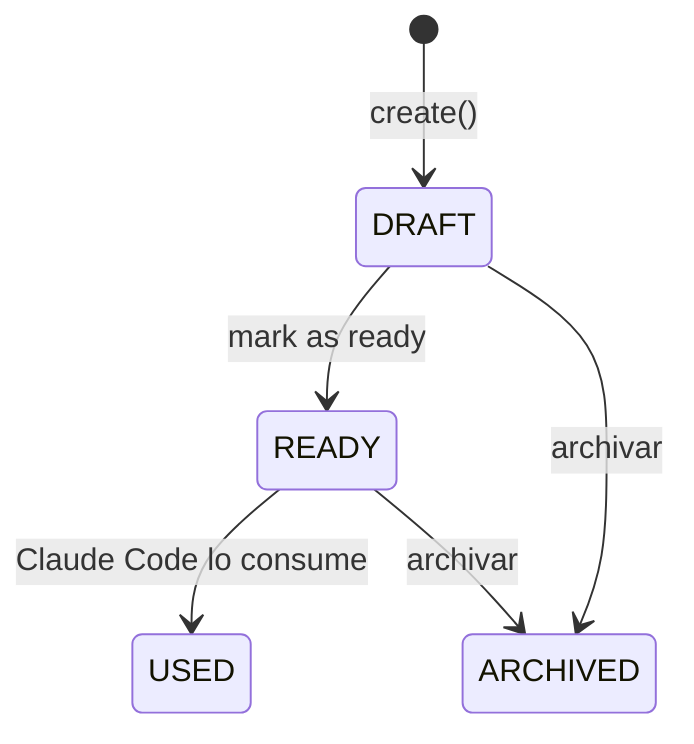

# Project — Visión General

## Objetivo

Módulo de meta-seguimiento del desarrollo del propio sistema Sapiens ERP. Permite gestionar sprints, tareas, historias de usuario con criterios de aceptación Gherkin, y planes de prompt para Claude Code. También integra la API de Anthropic para generar prompts asistidos por IA.

## Contexto

Este módulo no gestiona operaciones de la pescadería — gestiona el **desarrollo del sistema mismo**. Es una herramienta de productividad interna para el equipo de dos personas: Manuel (DEV) y Iskian (QA).

## Responsabilidades

- CRUD de Sprints con ciclo de vida (DRAFT → ACTIVE → COMPLETED)
- CRUD de tareas (`ProjectTask`) asignables a Manuel o Iskian, con estados Kanban
- CRUD de planes de prompt (`PromptPlan`) para Claude Code, con estados de uso
- CRUD de historias de usuario (`UserStory`) con escenarios Gherkin (UserStoryScenario)
- Integración con Anthropic API para generar prompts de IA (`POST /api/v1/ai/generate-prompt`)

## Diferencias con otros módulos

| Característica | Otros módulos | Project |
|---------------|--------------|---------|
| Autorización | `@PreAuthorize` por rol | Ninguna (solo autenticado) |
| Usuarios del módulo | Operadores del negocio | Manuel e Iskian (hardcoded en enum) |
| Propósito | Gestión del negocio | Gestión del desarrollo |

## Casos de uso principales

1. Manuel crea Sprint 2 y lo activa
2. Manuel crea tarea "Implementar módulo de ventas" y la asigna a sí mismo
3. Claude Code lee un PromptPlan en estado READY y ejecuta las instrucciones
4. Iskian crea una UserStory con 3 escenarios Gherkin
5. Manuel pide a la IA generar un prompt para una tarea específica

## Flujo de ciclo de vida de Sprint

## Flujo de ciclo de vida de PromptPlan

