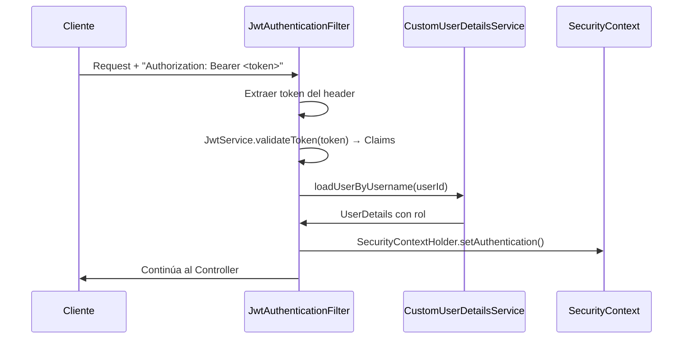

# Seguridad — Sapiens ERP

## Arquitectura de seguridad

Sapiens ERP implementa autenticación stateless con JWT (JSON Web Tokens) y autorización basada en roles usando Spring Security.



## JWT Configuration

| Parámetro | Valor por defecto | Env var |
|-----------|------------------|---------|
| Secret | `sapiens-erp-secret-key-change-in-production-min32` | `JWT_SECRET` |
| Access token expiry | 15 minutos (900,000 ms) | — |
| Refresh token expiry | 7 días (604,800,000 ms) | — |
| Algoritmo | HMAC-SHA (Keys.hmacShaKeyFor) | — |

### Claims del access token

```json
{
  "sub": "<user-uuid>",
  "name": "Administrator",
  "role": "ADMIN",
  "iat": 1719532800,
  "exp": 1719533700
}
```

### Refresh tokens

- Se generan como bytes aleatorios (64 bytes, SecureRandom), codificados en Base64 URL
- Se almacenan en BD **solo su hash SHA-256** (`token_hash`)
- Al usarse para refresh: el token viejo se revoca (`revoked_at`), se emite uno nuevo (rotación)
- Se invalidan explícitamente en logout

## Roles

| Rol | Nivel | Descripción |
|-----|-------|-------------|
| `ADMIN` | 3 (mayor) | Acceso total al sistema |
| `SUPERVISOR` | 2 | Puede crear/modificar entidades de negocio |
| `OPERATOR` | 1 (menor) | Puede registrar entradas/salidas de inventario |

### Endpoints públicos (sin autenticación)

```
POST /api/v1/auth/login
POST /api/v1/auth/refresh
POST /api/v1/auth/logout
GET  /actuator/health
```

### Permisos por endpoint

| Acción | Roles mínimos |
|--------|--------------|
| Leer cualquier recurso | Cualquier usuario autenticado |
| Crear/editar productos, categorías | SUPERVISOR, ADMIN |
| Registrar entradas de inventario | OPERATOR, SUPERVISOR, ADMIN |
| Registrar salidas de inventario | OPERATOR, SUPERVISOR, ADMIN |
| Registrar mermas | SUPERVISOR, ADMIN |
| Ajustes de inventario | SUPERVISOR, ADMIN |
| Crear/editar proveedores | SUPERVISOR, ADMIN |
| Confirmar/recibir OCs | SUPERVISOR, ADMIN |
| Registrar pagos | SUPERVISOR, ADMIN |
| Crear cuentas financieras | SUPERVISOR, ADMIN |
| Módulo de proyecto (sprint, task, prompt) | Todos los autenticados (sin restricción de rol) |

## Configuración CORS

```java
config.setAllowedOrigins(List.of("http://localhost:5173")); // configurable vía CORS_ORIGIN
config.setAllowedMethods(List.of("GET", "POST", "PUT", "PATCH", "DELETE", "OPTIONS"));
config.setAllowedHeaders(List.of("Authorization", "Content-Type"));
config.setAllowCredentials(true);
// Solo aplica a /api/**
```

**Importante**: En producción cambiar `CORS_ORIGIN` al dominio real. Nunca usar `allowedOrigins("*")` con `allowCredentials(true)`.

## Codificación de contraseñas

- Algoritmo: **BCrypt con cost factor 12**
- Implementación: `BCryptPasswordEncoder(12)` de Spring Security

## Usuario inicial (DataInitializer)

Al iniciar la aplicación por primera vez, se crea automáticamente:

```
Email:    admin@sapiens.com
Password: Admin1234!
Rol:      ADMIN
```

Si el usuario ya existe (por email), no se recrea.

## Filtro JWT (JwtAuthenticationFilter)

1. Extrae el header `Authorization: Bearer <token>`
2. Llama a `JwtService.validateToken()` — lanza excepción si el token es inválido o expirado
3. Extrae `subject` (UUID del usuario) de los Claims
4. Carga el usuario via `CustomUserDetailsService.loadUserByUsername(userId)`
5. Crea un `UsernamePasswordAuthenticationToken` con las authorities del rol
6. Lo establece en `SecurityContextHolder`
7. La autorización por método (`@PreAuthorize`) evalúa el rol

## Autorización por método

Se usa `@PreAuthorize` con el patrón `hasAnyRole(...)`:

```java
@PreAuthorize("hasAnyRole('SUPERVISOR', 'ADMIN')")
public ResponseEntity<ProductResponse> create(...) { ... }

@PreAuthorize("hasAnyRole('OPERATOR', 'SUPERVISOR', 'ADMIN')")
public ResponseEntity<MovementResponse> registerEntry(...) { ... }
```

El módulo `project` no tiene `@PreAuthorize` — todos los usuarios autenticados pueden gestionar sprints, tareas y prompts.
