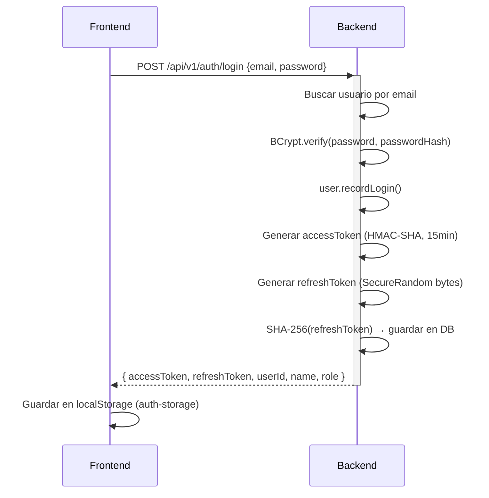
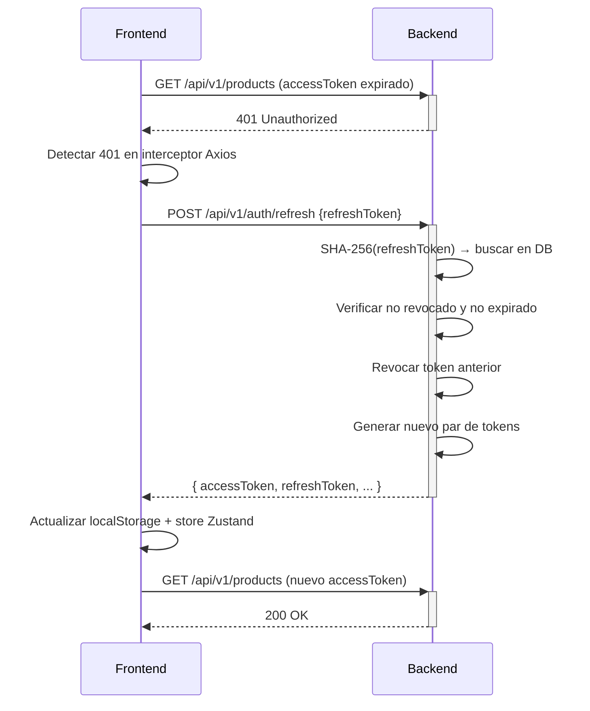

# Autenticación — Documentación Compartida

## Mecanismo

Sapiens ERP usa **JWT stateless** con dos tokens:

| Token | Duración | Almacenamiento backend |
|-------|---------|------------------------|
| Access Token | 15 minutos | No almacenado (stateless) |
| Refresh Token | 7 días | Hash SHA-256 en `refresh_tokens` |

---

## Flujo de login



---

## Access Token

Generado con JJWT 0.12.6, algoritmo HMAC-SHA. Contiene los claims:

```json
{
  "sub": "550e8400-e29b-41d4-a716-446655440000",
  "name": "Administrator",
  "role": "ADMIN",
  "iat": 1717200000,
  "exp": 1717200900
}
```

La firma usa la clave definida en `JWT_SECRET` (variable de entorno). El secreto debe ser base64-encoded y de al menos 256 bits.

---

## Refresh Token

- Generado como array de bytes aleatorios via `SecureRandom`
- Enviado al cliente como string URL-safe (Base64 o hex)
- Almacenado en BD como `SHA-256(token)` — nunca el token crudo

**Rotación**: cada uso del refresh token crea un nuevo par de tokens y revoca el anterior (`revokedAt = now()`).

---

## Flujo de auto-refresh (Frontend)



Si el refresh falla (token expirado o revocado):
```javascript
// client.ts
localStorage.clear();
window.location.reload();
```

---

## Almacenamiento en Frontend

Zustand store persistido en `localStorage` con la clave `auth-storage`:

```json
{
  "state": {
    "accessToken": "eyJhbGciOiJIUzI1NiJ9...",
    "refreshToken": "abc123urlSafe...",
    "user": {
      "id": "...",
      "name": "Administrator",
      "role": "ADMIN"
    }
  }
}
```

**Nota de seguridad**: almacenar tokens en localStorage los expone a ataques XSS. Una alternativa más segura sería usar cookies HttpOnly, pero no está implementada actualmente.

---

## Usuario inicial

Al arrancar el backend, `DataInitializer.java` verifica si existe `admin@sapiens.com`. Si no existe, lo crea con:
- **Password**: `Admin1234!`
- **Role**: `ADMIN`
- **BCrypt cost**: 12

---

## Configuración

```yaml
# application.yml
jwt:
  secret: ${JWT_SECRET}          # Variable de entorno obligatoria
  access-expiration: 900000      # 15 minutos en ms
  refresh-expiration: 604800000  # 7 días en ms
```
