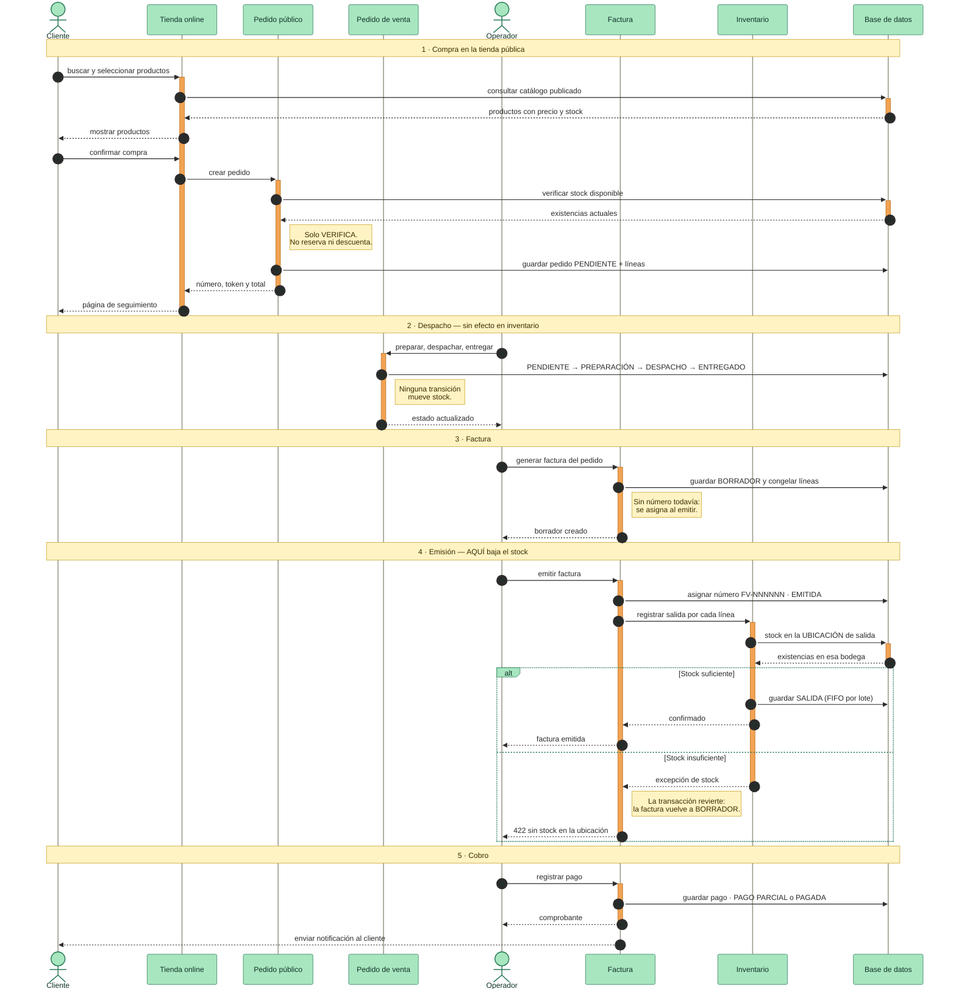

# Flujo de venta: de la tienda pública al descuento de inventario

> Recorrido completo de un pedido del cliente final hasta que el stock baja.
> Verificado de punta a punta el 2026-08-24 con el pedido `EP-001006`.

Relacionado: [[architecture/integration-flows]] · [[modules/sales/module]] ·
[[modules/inventory/business-rules]] · [[decisions/adr-004-stock-from-movements]]

---

## El punto que más confunde

**El inventario NO se descuenta al entregar el pedido. Se descuenta al emitir
la factura.**

Un pedido puede recorrer *Pendiente → Preparación → Despacho → Entregado* sin
tocar una sola unidad de stock. El egreso ocurre en
`SalesInvoiceService.emit()`, que llama a `decrementStockForSale()`.

Es deliberado: el movimiento de inventario queda atado al documento que
respalda la venta, no al estado logístico. Si el pedido se entrega pero la
factura se anula, la reposición tiene un documento contra el cual reversarse.

---

## Diagrama de secuencia



En la interfaz, los pasos 4 y 5 están unidos: el botón **Cobrar** de un
borrador emite y registra el pago en una sola acción. No existe botón
«Emitir» por separado, aunque la API sí lo expone.

---

## La trampa de las dos medidas de stock

El sistema calcula existencias de dos maneras distintas, y **no siempre
coinciden**:

| Quién pregunta | Consulta | Considera la ubicación |
|---|---|---|
| La tienda, para mostrar disponibilidad | `calculateCurrentStock(productId)` | **No** |
| La factura, para descontar | `calculateStockAtLocation(productId, locationId)` | **Sí** |

Si una entrada se registró sin bodega, el producto suma al total pero no
pertenece a ninguna ubicación. La tienda lo vende y la emisión falla con
`422 INSUFFICIENT_STOCK_AT_LOCATION`.

Ocurrió de verdad: siete entradas quedaron sin bodega porque `warehouseId` era
opcional en `EntryRequest`. Se corrigió con el script del repositorio
`deploy/reparacion/entradas-sin-bodega.sql` (fuera del vault, por eso no lleva
enlace interno).

> Mientras las dos consultas difieran, seguirá siendo posible vender algo que
> después no se puede despachar. La solución de fondo es que la tienda mida la
> disponibilidad por ubicación, igual que la factura.

---

## Los movimientos no se pueden editar

Corregir datos de inventario con `UPDATE` **no funciona y no avisa**. La base
lo impide con reglas que descartan la operación en silencio:

```sql
CREATE RULE no_update_inventory_movements
  AS ON UPDATE TO inventory_movements DO INSTEAD NOTHING;
CREATE RULE no_delete_inventory_movements
  AS ON DELETE TO inventory_movements DO INSTEAD NOTHING;
```

Un `UPDATE` devuelve `UPDATE 0` sin error. Toda corrección se hace con
movimientos nuevos que compensen:

```
ENTRY  10  (sin bodega)          <- se queda: es lo que ocurrió
+ AJUSTE +10 -> Bodega principal <- pone el stock donde existe
+ AJUSTE -10 <- sin ubicación    <- retira el fantasma
------------------------------------
  total 10  ·  en bodega 10
```

Los **lotes** sí admiten actualización: no son historia, son el estado actual,
y el FIFO por ubicación necesita saber dónde está cada uno.

---

## Estados

```
Pedido     PENDING -> PREPARING -> DISPATCHED -> DELIVERED
                                              \-> CANCELLED

Factura    DRAFT -> ISSUED -> PARTIALLY_PAID -> PAID
                        \-> CANCELLED (genera nota crédito)
```

Anular una factura ya emitida repone el stock con un `POSITIVE_ADJUSTMENT`
(`restoreStockForSale`), nunca borrando el `EXIT` original.

---

## Deuda conocida

- **El envío no se factura.** El cliente paga el domicilio, el valor queda en
  `sales_orders.shipping_cost` y no llega a la factura. Se factura por debajo
  de lo cobrado.
- **Sin botón «Emitir»** en la interfaz: un borrador solo ofrece *Cobrar*, que
  hace las dos cosas. No se puede emitir a crédito sin cobrar.
- **`warehouseId` opcional al ingresar** mercancía: la causa de que el stock
  pueda quedar fuera de toda bodega.
